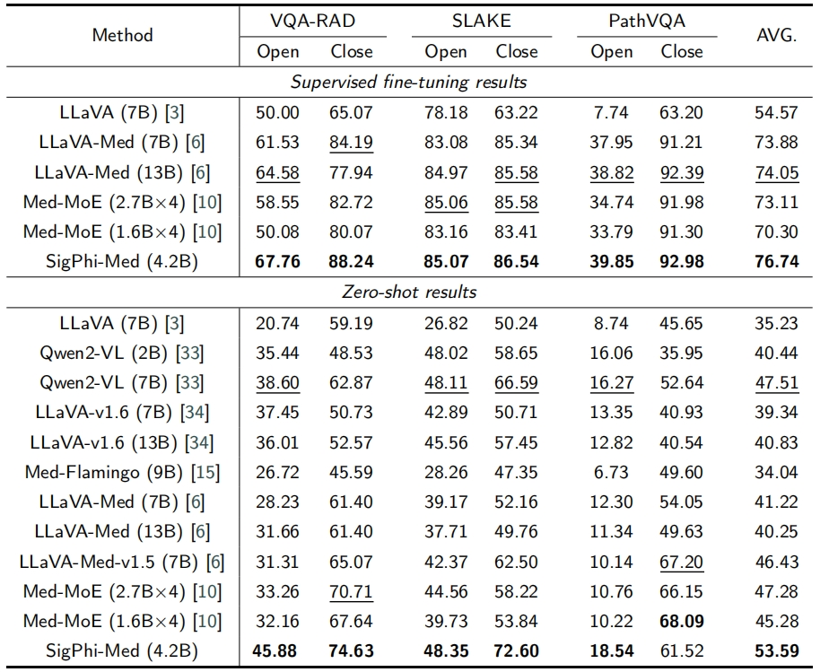

# SigPhi-Med: A Lightweight Vision-Language Assistant for Biomedicine

## Introduction
SigPhi-Med is a lightweight vision-language model designed for biomedical applications. It leverages compact architectures while maintaining strong performance in visual question answering (VQA) and related multimodal tasks. This repository provides code for training, evaluation, and model deployment.

## Results
<p align="center">
    
</p>

## Installation
To set up the environment, refer to [TinyLLaVA Factory](https://github.com/TinyLLaVA/TinyLLaVA_Factory) and `requirements.txt` file.

## Model Weights
- [Huggingface](https://huggingface.co/nykxo99/SigPhi-Med)

## Datasets
SigPhi-Med is trained and evaluated on the following biomedical multimodal datasets:

- [LLaVA-Med Dataset](https://github.com/microsoft/LLaVA-Med)
- [PubMedVision Dataset](https://huggingface.co/datasets/FreedomIntelligence/PubMedVision)

## Training
To train SigPhi-Med, modify the training script as needed:

1. Edit the configuration in `scripts/train/train_phi.sh`.
2. Run the training script:

```bash
sh scripts/train/train_phi.sh
```

## Evaluation
To evaluate the model on biomedical VQA tasks, use:

```bash
sh scripts/eval/VQA.sh
```

## Acknowledgements
We appreciate the contributions of the following projects:
- [TinyLLaVA](https://github.com/TinyLLaVA/TinyLLaVA_Factory)
- [LLaVA-Med Dataset](https://github.com/microsoft/LLaVA-Med)
- [PubMedVision Dataset](https://huggingface.co/datasets/FreedomIntelligence/PubMedVision)

